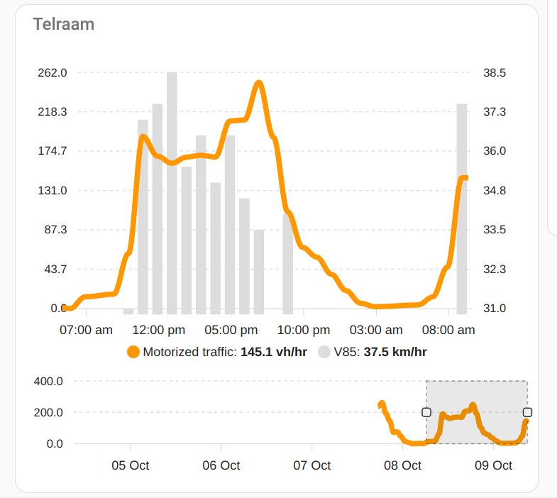

# Telraam Custom Component for Home Assistant

This custom component integrates Telraam traffic data into Home Assistant, allowing you to monitor car, bike, pedestrian, and night traffic data from your Telraam devices.

## Features

- Monitor traffic data directly in Home Assistant.
- Support for multiple Telraam devices.
- Easy configuration via Home Assistant UI.

## Prerequisites

Before you begin, ensure you have a functioning Home Assistant installation and access to your Telraam API key and device IDs.

## Installation

### Using HACS

This component is compatible with the Home Assistant Community Store (HACS). To install it using HACS, follow these steps:

[](https://my.home-assistant.io/redirect/hacs_repository/?owner=kervel&repository=telraam-hacs&category=integration)

[](https://my.home-assistant.io/redirect/config_flow_start/?domain=telraam)

### Manual Installation

If you prefer not to use HACS, you can install the component manually:

1. Download the `telraam` folder from this repository.
2. Place it into your `config/custom_components/` directory.
3. Restart Home Assistant.

## Configuration

After installation, add the Telraam integration via the Home Assistant UI:

1. Navigate to **Configuration** > **Integrations**.
2. Click on the "+ Add Integration" button.
3. Search for "Telraam" and follow the on-screen instructions to configure the integration with your API key and segment ID 
    * Segment ID has 10 digits starting with 90, not: device ID (15 digits starting with 20). You can get the segemnt ID from the URL, if you select a segment on the [map](https://telraam.net/) and click on the details page via *more data*: `https://telraam.net/en/location/<segment ID like 90xxxxxxxx>`.

## Adding a widget to your dashboard

An example widget configuration using the HACS apexcharts plugin:

```yaml
type: custom:apexcharts-card
header:
  show: true
  title: Telraam
yaxis:
  - id: first
  - id: second
    opposite: true
series:
  - entity: sensor.total_motorized
    yaxis_id: first
    name: Motorized traffic
    unit: vh/hr
    show:
      in_brush: true
  - entity: sensor.85th_percentile_speed
    yaxis_id: second
    name: V85
    type: column
    stroke_width: 7
    color: "#dddddd"
    unit: km/hr
brush:
  selection_span: 24hr
graph_span: 5d
experimental:
  brush: true
```




## Support

If you encounter issues or have questions, please file an issue on this GitHub repository.

## Contributing

Contributions are welcome! If you would like to contribute to this project, please feel free to make a pull request.

## License

This project is licensed under the MIT License - see the LICENSE file for details.
